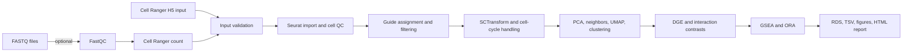

# Perturb-seq Analysis Pipeline

**Author:** Mohamed Kassam  
**Repository prepared:** July 19, 2026  
**Status:** Example-ready reference implementation; biological validation is required before production use.

A modular Nextflow, R, and Python workflow for Perturb-seq processing and analysis. The pipeline supports guide-level QC, normalization, cell-cycle handling, differential expression, treatment-by-perturbation comparisons, and pathway enrichment. Experimental controls and contrasts are supplied through metadata and YAML configuration rather than hard-coded in source code.

## Scope

The primary open-source entry point is a Cell Ranger `filtered_feature_bc_matrix.h5` file containing Gene Expression and, when available, CRISPR Guide Capture assays. An optional FASTQ-to-Cell-Ranger process is included, but Cell Ranger and its references must be installed separately under the applicable 10x Genomics license.

This repository contains source code and configuration templates only. Generated demonstration outputs and synthetic matrices are deliberately excluded from version control.

## Architecture



See [`docs/ARCHITECTURE.md`](docs/ARCHITECTURE.md) for detailed diagrams and [`docs/UNDERSTANDING.md`](docs/UNDERSTANDING.md) for the design rationale, assumptions, and limitations.

## Installation

### Conda or Micromamba

```bash
micromamba create -f environment.yml
micromamba activate perturbseq
```

### Docker

```bash
docker build -t perturbseq-pipeline:local .
```

Cell Ranger is intentionally not bundled in the open-source environment.

## Input preparation

### Samplesheet

Copy `example/samplesheet.csv` and replace the example path. Required columns are:

- `sample_id`: unique sample identifier
- `h5_path`: absolute path to a Cell Ranger H5 file
- `treatment`: treatment or stimulation label
- `cell_line`: biological model
- `replicate`: biological replicate identifier

Additional metadata columns may be included and used as covariates.

### Experiment definition

Copy `example/experiment.yaml` and define:

- Metadata column names
- Reference treatment and perturbation levels
- Automatic contrast classes
- Optional explicit contrasts

No source-code change is required when controls are called `DMSO`, `Vehicle`, `Untreated`, `PBS`, or another value.

## Run

```bash
nextflow run main.nf \
  -profile conda \
  --samplesheet samplesheet.csv \
  --config conf/analysis.yaml \
  --outdir results
```

To start from FASTQs, additionally provide `--run_cellranger`, `--input`, `--transcriptome`, and the appropriate feature/guide reference. This mode requires a separately installed Cell Ranger executable.

## Analysis stages

1. Validate the sample sheet and input paths.
2. Import gene-expression and guide-capture matrices.
3. Calculate cell QC metrics and optionally detect doublets.
4. Assign dominant guides using UMI and top-to-second-guide thresholds.
5. Score cell cycle and normalize using SCTransform v2.
6. Perform dimensionality reduction and clustering.
7. Generate metadata-driven treatment, perturbation, conditional, and explicit contrasts.
8. Run DGE with MAST or an appropriately configured replicate-aware method.
9. Run preranked GSEA and over-representation analysis.
10. Export analysis objects, tables, figures, and workflow provenance.

## Testing

```bash
python -m py_compile bin/*.py
pytest -q
nextflow config . >/dev/null
```

The included tests cover input validation and metadata-driven contrast generation. They are software unit tests, not biological validation tests.

## Statistical interpretation

Cell-level inference can overstate significance when cells are treated as independent replicates. When multiple biological replicates are available, pseudobulk edgeR, limma-voom, or DESeq2 approaches should be preferred. For unreplicated experiments, interpretation should emphasize effect size, target suppression, guide concordance, consistency across guides, and pathway-level coherence rather than adjusted p-values alone.

## Outputs

Typical outputs include:

- `perturbseq_seurat.rds`
- Cell-level metadata and guide assignments
- QC and UMAP figures
- Per-contrast DGE tables
- GSEA/ORA tables
- Nextflow execution report, timeline, trace, and DAG

## Repository structure

```text
.
├── main.nf                  # Nextflow entry point
├── nextflow.config          # Runtime profiles and resources
├── modules/                 # DSL2 processes
├── R/                       # Seurat and statistical analysis
├── bin/                     # Validation and contrast utilities
├── conf/analysis.yaml       # Technical analysis defaults
├── example/                 # Input/configuration templates only
├── docs/                    # Architecture and example documentation
├── tests/                   # Software unit tests
├── environment.yml          # Reproducible software environment
└── .github/workflows/ci.yml # Continuous integration
```

## Limitations

- Cell Ranger is external and licensed separately.
- Thresholds require dataset-specific review.
- Interaction effects require appropriate controls and replication.
- The repository has not been validated against a specific client dataset.
- Gene-set resources can change and should be version-pinned for regulated work.

## License and attribution

Copyright © 2026 Mohamed Kassam. See `LICENSE`. Third-party tools retain their respective licenses.
