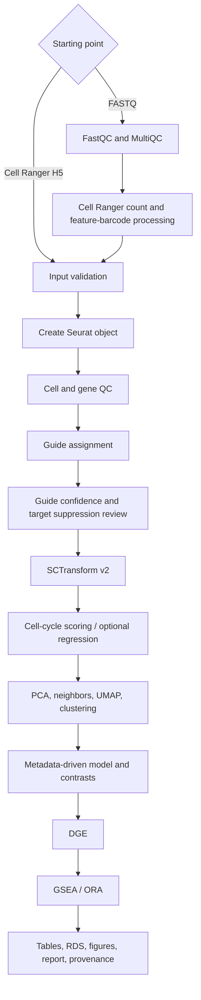
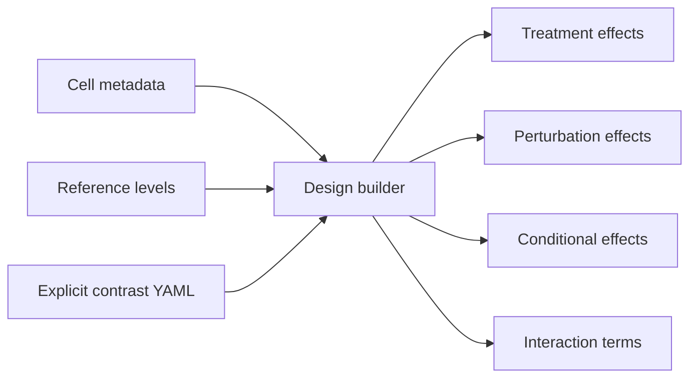
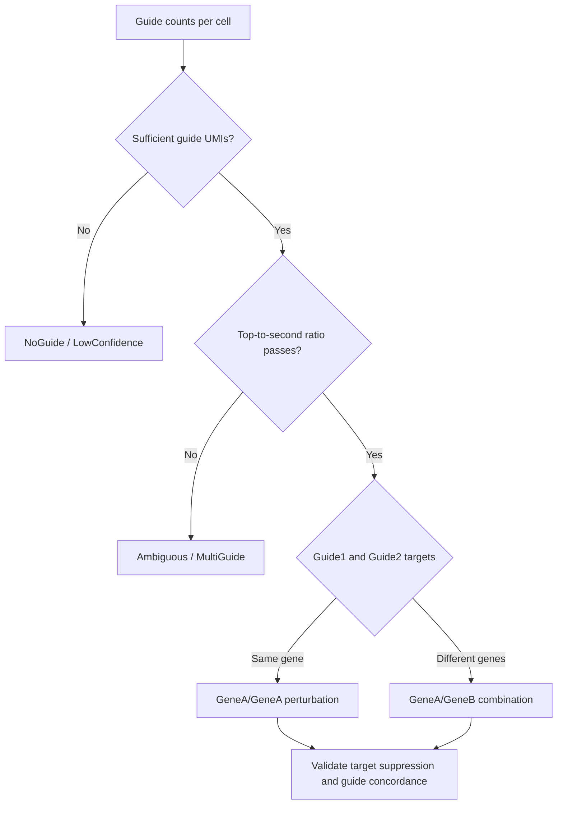
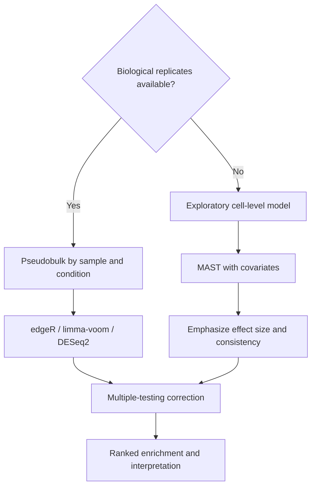

# Architecture and General Diagrams

**Author:** Mohamed Kassam  
**Date:** July 19, 2026

## End-to-end workflow

## Metadata-driven contrast model

## Dual-guide decision logic

## Statistical decision framework

## General example description

This repository separates orchestration, scientific analysis, and experiment-specific configuration. Nextflow provides reproducible execution and provenance; R provides established single-cell and statistical methods; Python performs input validation and design/contrast generation. The main trade-off is flexibility versus strict assumptions: the software remains generic, while the experiment YAML makes controls and desired comparisons explicit and auditable.
